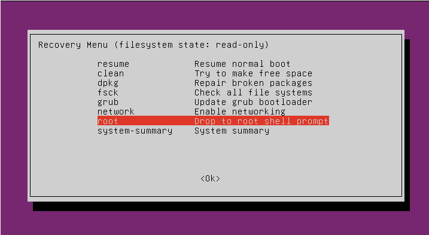
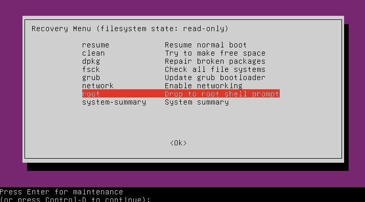
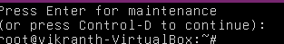
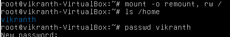
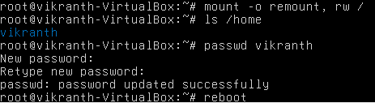

# 🔐 Linux Password Reset Lab (Ubuntu)

## 📌 What This Project Shows

This lab shows how someone with physical access to a Linux machine can reset a user password using GRUB recovery mode.

It demonstrates why physical security is important.

## 🖥 Lab Setup
- Ubuntu (Virtual Machine)
- VirtualBox
- GRUB Bootloader

## 🛠 What I Did
- Rebooted the system
- Opened GRUB menu
- Entered recovery mode
- Dropped into root shell
- Remounted filesystem as writable
- Reset the user password
- Rebooted and logged in successfully

## 🖼 Screenshots

### 1️⃣ GRUB Recovery Menu


### 2️⃣ Root Shell Option


### 3️⃣ Root Terminal Access


### 4️⃣ Password Reset Command


### 5️⃣ Password Successfully Updated


### 6️⃣ System Login Success


## 🔑 Key Commands Used
```bash
mount -o remount,rw /
ls /home
passwd username
reboot


